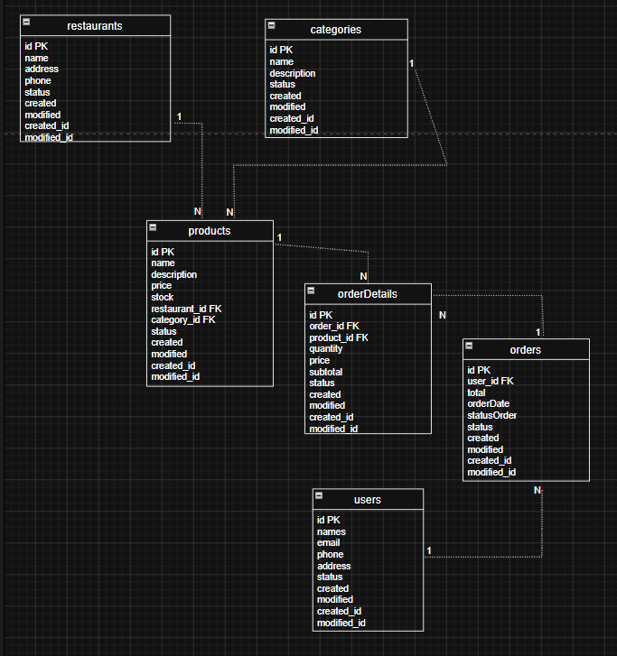
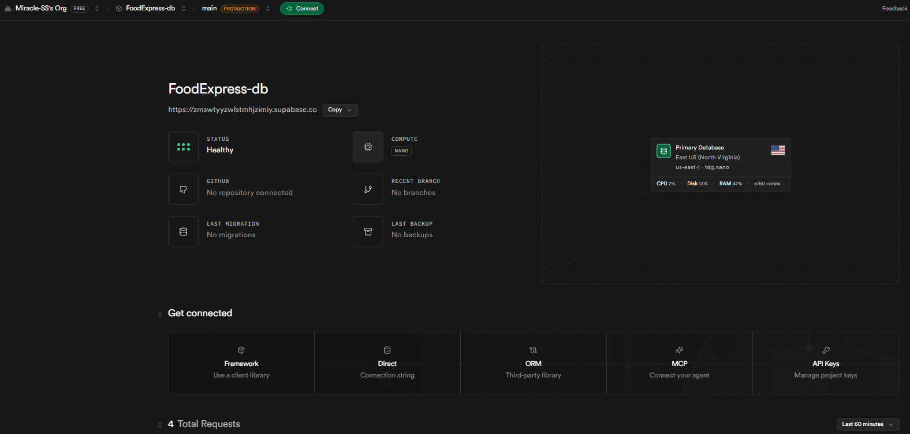
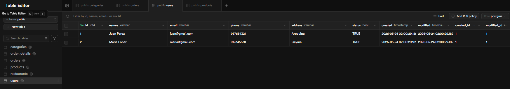
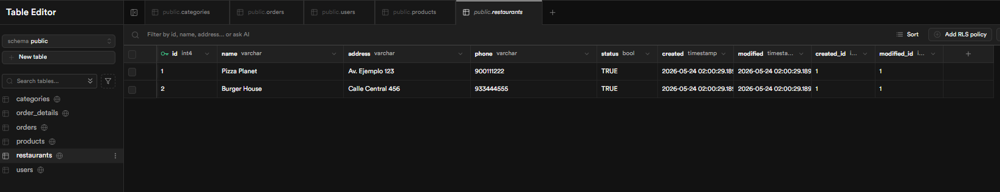
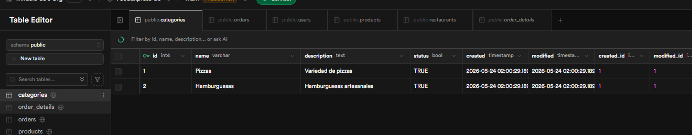
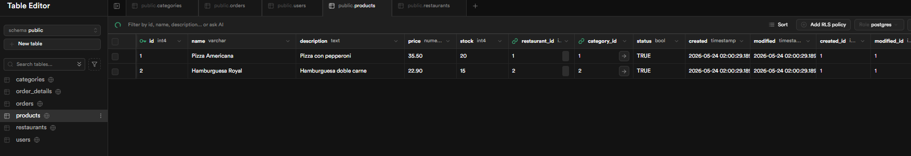
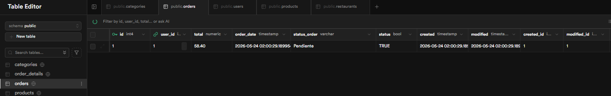
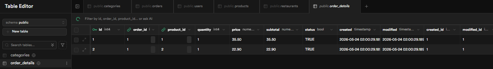

# FoodExpress Delivery

Sistema de base de datos para una plataforma de delivery de comida desarrollado utilizando PostgreSQL y Supabase como Backend as a Service (BaaS).

---

# Descripción del Proyecto

FoodExpress Delivery es un sistema orientado a la gestión de pedidos de comida entre usuarios y restaurantes. La base de datos permite almacenar información relacionada con usuarios, restaurantes, categorías de productos, productos disponibles, pedidos y detalle de pedidos.

El sistema fue diseñado aplicando el modelo Entidad–Relación (DER), posteriormente transformado al modelo lógico relacional e implementado físicamente en PostgreSQL mediante Supabase.

---

# Objetivos

- Comprender el funcionamiento de bases de datos relacionales.
- Diseñar un modelo Entidad–Relación (DER).
- Implementar un modelo físico en PostgreSQL.
- Utilizar Supabase como plataforma Backend as a Service.
- Realizar consultas SQL utilizando relaciones entre tablas.

---

# Tecnologías Utilizadas

- PostgreSQL
- Supabase
- SQL
- Draw.io
- Visual Studio Code
- GitHub

---

# Modelo Entidad–Relación (DER)

El sistema fue diseñado utilizando un modelo DER que representa las entidades principales y sus relaciones.

## Entidades principales

- users
- restaurants
- categories
- products
- orders
- order_details

## Relaciones

- Un usuario puede realizar muchos pedidos.
- Un pedido puede contener varios productos.
- Un producto puede pertenecer a muchos pedidos.
- Un restaurante puede ofrecer muchos productos.
- Una categoría puede contener muchos productos.

## Imagen del DER



---

# Modelo Físico PostgreSQL

La implementación física fue realizada utilizando instrucciones SQL en PostgreSQL.

## Principales características implementadas

- Claves primarias (`PRIMARY KEY`)
- Claves foráneas (`FOREIGN KEY`)
- Relaciones entre tablas
- Restricciones de integridad
- Tipos de datos relacionales

## Archivo SQL

El archivo principal de implementación es:

```text
database.sql
```

---

# Implementación en Supabase

La base de datos fue implementada y administrada mediante Supabase utilizando PostgreSQL en la nube.

## Funcionalidades utilizadas

- SQL Editor
- Table Editor
- Inserción de registros
- Consultas SQL
- Gestión de relaciones

## Capturas

### Vista general del proyecto



### Tabla users



### Tabla restaurants



### Tabla categories



### Tabla products



### Tabla orders



### Tabla order_details



### Consulta SQL JOIN


---

# Consultas SQL

## Consulta de usuarios

```sql
SELECT * FROM users;
```

## Consulta JOIN

```sql
SELECT 
    orders.id AS order_id,
    users.names AS customer,
    products.name AS product,
    order_details.quantity,
    order_details.subtotal
FROM order_details
JOIN orders ON order_details.order_id = orders.id
JOIN users ON orders.user_id = users.id
JOIN products ON order_details.product_id = products.id;
```

---

# Resultados

- Se implementó correctamente el modelo físico de la base de datos.
- Las relaciones entre tablas funcionaron adecuadamente.
- Se realizaron inserciones y consultas SQL exitosamente.
- Supabase permitió administrar PostgreSQL mediante una plataforma en la nube.

---

# Conclusiones

El desarrollo del laboratorio me permitió comprender la importancia del diseño de bases de datos relacionales utilizando modelos DER y PostgreSQL. Asimismo, Supabase facilitó la implementación y administración de la base de datos en la nube mediante herramientas modernas y eficientes.

---

# Repositorio

El proyecto contiene:

- Código SQL
- DER
- Capturas de implementación
- README.md

---

# Video

Agregar aquí el enlace del video explicativo:

```text
https://...
```
